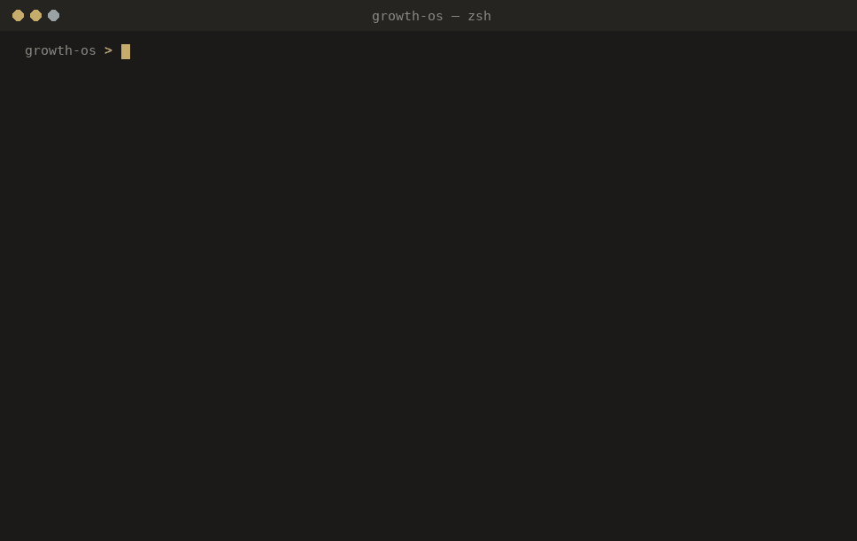

# Claude Code Growth OS

**Run your whole go-to-market inside Claude Code — not just your code.**


> **In one sentence:** Claude Code Growth OS is an open-source, MIT-licensed scaffold that turns Claude Code into a go-to-market operating environment — plain-text playbooks, daily rituals (morning briefing, follow-ups, end-of-day), guardrail hooks, and skill templates spanning all four growth functions (marketing, sales, product, and retention) — so your whole revenue motion runs from one git-tracked repo instead of living in your head.

Most people ask Claude Code to write code. You can also run your go-to-market in it: let it read your plain-text playbooks, run your daily rituals (the morning briefing, follow-ups, lead qualification, content) and reach your tools, so the whole motion runs from one place. Because everything is markdown in git, your sales & marketing system gets a diff, a history, and a blame view, and it stops living in your head.

Most sales & marketing skill packs just generate copy. This runs the operating day around it (qualify, prep, follow up, post) and keeps it all in git.

This repo is the scaffolding: opinionated hooks, daily rituals, a set of go-to-market skill templates spanning all four functions, and a worked example you can run in 30 seconds. **Bring your own playbooks — the structure is here.**

**Why one repo for the whole motion?** The buyer merged it — they research, buy, adopt, and renew as one relationship, and most of a B2B decision happens before sales is even in the room. Running marketing, sales, product, and retention as four separate systems is what creates the seams the buyer feels — and leaves the most valuable half, what happens *after* the sale, with no owner. This kit keeps all four in one place: one source of truth (the repo), two feedback loops (a `MARKETING-ACTION` line for sales→marketing, a `RETENTION-RISK` line for post-sale→product), shared definitions. The one-page argument, with sources, is in [`docs/why-align.md`](docs/why-align.md).

## See it run in 30 seconds



Clone, open in Claude Code, and run `/demo-briefing`. It runs the whole morning ritual against the fictional sample data in `demo/`:

```
Top 3 for today
1. Unstick Rheinkraft Manufacturing — 8 days quiet in Negotiation, no next step.
   Send a hold + a one-line "still worth doing?" today.            (advances a deal)
2. Ship the revised Thornbury Insurance proposal (two contexts) —
   committed for Friday. Draft this morning.                       (a commitment)
3. Start one new conversation — pick a target, send one note.      (outbound)

⚠ Slipping: Rheinkraft Manufacturing (DE) — Negotiation, 8 days no activity, no next step.

Tasks pulled from yesterday's meetings
- [Thornbury] Send revised two-context proposal           — due Fri
- [Thornbury] Intro Oliver to an insurance reference customer
- [Thornbury] Share the security overview pack
- [Cascadia] Send the ROI one-pager                       — before Wed
- [Cascadia] Confirm discovery invite incl. her two analysts

Flagged for marketing (loop 1: sales → marketing)
⚑ "How is this different from the BI tool we already have?" — 3rd time this month → needs a one-pager

Flagged for product (loop 2: post-sale → product)
⚑ Northwind Robotics — usage down 2 weeks, only 1 of 3 workflows adopted → retention risk

Pipeline: 6 deals · 1 slipping · 2 with no next step · 1 onboarding account at risk
```

Nothing there is real — delete `demo/` whenever you like.

## What's inside

| Piece | What it is |
|---|---|
| `.claude/hooks/` | Five guardrails: session-start context, **state re-injection across compaction**, a **commit secret-guard**, sensitive-file protection, an end-of-day nudge — plus a **web-session bootstrap** that installs the hook linter (`shellcheck`) on remote / Claude-Code-on-the-web containers |
| `.claude/commands/` | Daily rituals you invoke by name: `/morning-briefing`, `/midday-checkin`, `/end-of-day`, `/weekly-review`, plus `/demo-briefing` |
| `.claude/skills/` | Skill templates grouped by the four growth functions (see below) — so the balance across marketing, sales, product, and retention is visible, not acquisition-only |
| `.claude/rules/` | Standing constraints every session honors — how to reach a CRM over MCP (`crm-usage.md`) and how the to-do list renders one canonical way (`todo-single-source.md`); obeyed by interactive rituals and autonomous routines alike |
| `.claude/scheduling/` | Run the rituals on a clock — locally (cron/launchd), as **cloud Routines** (no machine awake), or as a CI backstop (the deterministic checks in `.claude/scripts/checks/`, run by a GitHub Actions `schedule:`). Full runbook in `cloud-routines.md` |
| `ops/` | Your plain-text playbooks — `priorities.md`, `daily-log.md`, `pipeline.md` (left side), `customers.md` and `roadmap-signals.md` (right side), and `feedback-log.md` (the shared cross-function loop). Start here. |
| `demo/` | A fictional pipeline *and* customer book so you can see the whole motion work (and present from it safely) |
| `docs/operating-model.md` | The spine: the bowtie, the four functions, the six handoffs (H1–H6), the one number (net revenue retention), and the three shared definitions |
| `docs/methodology.md` | The idea in full: Claude Code as an operating environment |
| `docs/why-align.md` | The one-page argument: why your whole go-to-market (marketing, sales, product, retention) runs as one system (with sources) |
| `docs/why-brand.md` | The companion argument: where demand comes from — why ~95% of buyers aren't ready yet, and how brands actually grow (with sources) |
| `docs/principles-from-science.md` | A thinking aid: twenty-one operating principles drawn from seven sciences (leverage, momentum, entropy…) — each with two sourced quotes and a worked go-to-market example |
| `docs/principles-from-history.md` | A companion thinking aid: operating principles drawn from history and biography (Churchill, via Manchester's *The Last Lion*) — each with a verified, sourced quote, a worked go-to-market example, and an apocrypha-screening note |
| `docs/principles-from-the-field.md` | A third thinking aid: operating principles drawn from running the motion itself (ownership, daily focus, decisions, reading the return, judgment, attention) — each with a worked go-to-market example, plus a map of where they land in the kit |
| `docs/connecting-a-crm.md` | Optional: make an existing CRM the source of truth and project it into `ops/pipeline.md` — don't run two pipelines |

**Skills by function** — the motion is balanced across the bowtie, not just acquisition:

| Function | Skills |
|---|---|
| **Marketing / Demand** | `content-repurpose`, `marketing-feedback` (sales→marketing loop) |
| **Sales** | `lead-qualify`, `meeting-prep`, `follow-up`, `cold-outreach` |
| **Product** | `product-signal` (routes field + retention signals to the roadmap; writes the buyer-facing line for anything shipped) |
| **Retention** | `onboarding-handoff` (Won→onboarding), `account-health` (adoption, renewal motion, churn/expansion), `retention-feedback` (post-sale→product loop) |
| **Cross-cutting** | `status-update`, `triage`, `calendar-followup` (unfinished follow-ups from last week's meetings), `inbox-digest` (unread newsletter digest) |

## How it fits together

One loop, all plain text in git:

1. **Open a session** → the SessionStart hook surfaces today's priorities.
2. **`/morning-briefing`** reads your priorities, yesterday's log, and your pipeline → today's top three.
3. **Through the day**, the skills work on your own data, on both sides of the bowtie. *Left side:* `lead-qualify` a new opportunity, `meeting-prep` before a call, `follow-up` after it, `cold-outreach` to a prospect, `content-repurpose` a win into posts, `marketing-feedback` to turn a recurring objection into a note marketing acts on. *Right side:* `onboarding-handoff` when a deal is won (carry the value hypothesis across the seam), `account-health` to score adoption and start the renewal motion at day 60, `product-signal` to route retention and field signals to the roadmap, and `retention-feedback` to turn an adoption slip into a signal product acts on.
4. **`/end-of-day`** logs what shipped and sets tomorrow; **`/weekly-review`** finds the patterns across both sides — renewals due, accounts at risk, expansion candidates, and the top roadmap signals.
5. **The hooks hold it together** — your state survives a long session (`pre-compact`), and nothing secret slips into a commit (`pre-commit-guard`).

The left side lives in `ops/pipeline.md`; the right side in `ops/customers.md` (the post-sale account book) and `ops/roadmap-signals.md` (product's triage queue). Priorities and notes round it out — all yours, with a fictional copy in `demo/`. Edit the markdown, commit, and your whole go-to-market has a history. The handoffs that connect the four functions are mapped in [`docs/operating-model.md`](docs/operating-model.md).

## Quickstart

1. Clone and open in Claude Code. The SessionStart hook surfaces `ops/priorities.md` immediately.
2. Run `/demo-briefing` to see the loop on sample data.
3. Edit `ops/priorities.md` with your own, run `/morning-briefing`, and commit. That's the loop.
4. Install the commit secret-guard once: `ln -s ../../.claude/hooks/pre-commit-guard.sh .git/hooks/pre-commit`

## The hooks earn their place

- **`pre-compact.sh`** re-injects your priorities and latest log when a long session compacts — your state lives in files, so the context window can't lose the thread.
- **`pre-commit-guard.sh`** blocks a commit if staged changes look like they contain a secret (API keys, private keys, tokens).
- **`protect-files.sh`** stops the agent writing to `.env`, keys, and credentials.
- **`session-start.sh`** opens the day with your priorities *and* the freshest cross-function loop signals (so the feedback log can't go stale silently); **`stop-reminder.sh`** closes it.
- **`web-bootstrap.sh`** runs only in remote / Claude-Code-on-the-web sessions (`CLAUDE_CODE_REMOTE=true`) and installs the one tool a fresh web container lacks — `shellcheck` — so you can lint the hooks in-session, matching CI. Skipped on your own machine, idempotent, and never blocks: a setup failure just logs a warning.

All pure bash (one uses `python3` to read a payload). No API keys, no MCP — it runs anywhere out of the box.

## Make it yours

- **`ops/`** — one file per area. Don't port your whole life on day one; pick the ritual you dread most and make it real.
- **`.claude/commands/`** — a ritual is just a markdown prompt. Copy one and tweak it — [write your first in 5 minutes](docs/first-ritual.md).
- **`.claude/skills/`** — a repeatable job, triggered by its `description`. Copy one of the included skills as a pattern.
- **Connect your tools** — copy `.mcp.json.example` → `.mcp.json` (gitignored) to add MCP servers (calendar, notes, issue tracker, CRM), and put any keys in `.claude/settings.local.json` (copy `.claude/settings.local.example.json`). Your commands and skills can then reach them. If a CRM is your system of record, [`docs/connecting-a-crm.md`](docs/connecting-a-crm.md) shows how to project it into `ops/pipeline.md` instead of running two pipelines.

## Portability

The `.claude/skills/` and `.claude/commands/` are plain markdown on the Agent Skills spec, so they port to other agents that support it with little change. The `hooks/` and `settings.json` are Claude-Code-specific — they won't carry over, and that's fine; the rituals and skills are the part worth taking elsewhere.

## What's deliberately not here

No real playbooks, positioning, pricing, or data. That's the point: the structure is reproducible; the judgment you put inside it is the part that's yours. Fill one drawer this week.

## What's free vs. what's paid

This is **open core**. The chassis is free and MIT-licensed; the part that took twenty-two years isn't in the box.

| Free — this repo (MIT) | Paid — built & run for you |
|---|---|
| The chassis: hooks, daily rituals, and go-to-market skill templates across all four functions, plus a 30-second runnable demo. Bring your own playbooks. | Your customized, *populated* operating system, with your best tools integrated, alongside real playbooks, positioning, pricing, ICP — plus the wider automation layer (a workflow-automation platform: vendor management, ICP checks, pre- and post-meeting briefings and follow-ups) as well as a localization-automation platform for multilingual content processes. Built and run for you, or run by a growth operator who works this way. |

The repo is the skeleton; the judgment you put inside it is the product → **[langoptima.com/features/growth](https://langoptima.com/features/growth)**.

## Who's behind this

I'm Edwin Trebels — I run our company's entire go-to-market on a setup like this, and help clients run theirs. This repo is the open skeleton. The full version adds the wider automation layer (a workflow-automation platform handling vendor management, ICP checks, pre-meeting briefings, post-meeting debriefs and follow-ups, and the assistant that keeps the day straight; a localization-automation platform for multilingual content), plus the judgment that fills the empty drawers. That part took twenty-two years and doesn't come in a folder.

Want it built and run for you, or a growth operator who works this way? That's what I do: [langoptima.com/features/growth](https://langoptima.com/features/growth). The thinking behind the kit is in [`docs/methodology.md`](docs/methodology.md).

**If it's useful, a ⭐ helps others find it.** PRs welcome — see [CONTRIBUTING.md](CONTRIBUTING.md). MIT licensed.
